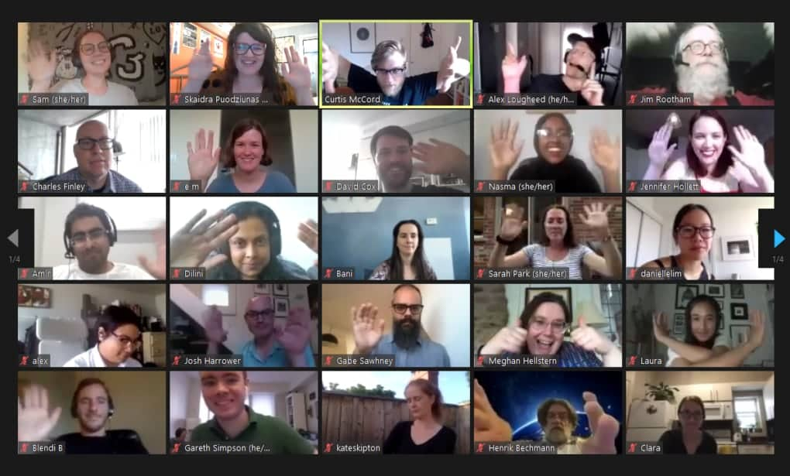

<article class="grid">
  <figure>
    
    <figcaption>
      Fifth Anniversary of Civic Tech
    </figcaption>
  </figure>
  

    <hgroup>
    <h1>Hacknights for everyone.</h1>
    
Every Tuesday from 7pm to 9pm.

    </hgroup>
    
We run Hacknights every Tuesday 7 pm – 9 pm for members of the community gather, hear from inspiring speakers and collaborate on projects aimed at improving Toronto.

    

      <a role="button" class="outline" href="https://guild.host/ctto/events" target="_blank">Sign Up on Guild&nbsp;↗</a>
      <a role="button" class="secondary outline" href="{{'/hacknights' | relative_url }}">See past Hacknights</a>
    

  

</article>

<!-- === Recent Hacknights ===  -->

<!-- Past Hacknights -->




<section>
  <header>
    <h2>Recent Hacknights</h2>
  </header>
  

    
      
      
        
          
          
        
      
      

      <article class="card card-row filterRow" data-topics="{{ topics_string }}">
        

        
          

            
          

        
          

            <small>{{ event.date | date: "%B %d, %Y" }}</small> 
            <strong>Hacknight #{{ event.number }}</strong> 
            <a href="{{ event.url }}"><strong>{{ event.topic }}</strong></a>
            
            
               
              
              
                
                
              
              <small>with {{ speakers_list | join: ", " }}</small>
            
          

          

            <a role="button" href="{{ event.url }}">View</a>
          

        

      </article>
    
  

  <a href="{{ '/hacknights' | relative_url }}">See all Hacknights here.</a>
</section>

<!-- === Projects Feature ===  -->



<section>
  <header>
    <h2>Current Featured Projects</h2>
  </header>
  

    
      
      
      
        
          
          
        
      
      

      <article class="card card-row filterRow" data-topics="{{ topics_string }}">
        

          

            <h3><a href="{{ project.url }}">{{ project.title }}</a></h3>
            
              
{{ project.excerpt }}

            
            
              
            
          

          

            
              <a role="button" class="outline" href="{{ project.project_website }}" target="_blank" rel="noopener">Website</a>
            
            <a role="button" href="{{ project.url }}">View</a>
          

        

      </article>
      
    
  

  <a href="{{ '/projects' | relative_url }}">See all projects here.</a>

</section>

<!-- === Call to Actions ===  -->

<section>
  <hgroup>
  <h2>Calls to Action</h2>
  
Things to click!

  </hgroup>
  

    <article>
      <h3>About Us</h3>
      
Learn about CivicTech Toronto.

      <a role="button" href="{{ '/about-us' | relative_url  }}">About Us</a>
    </article>
    <article>
      <h3>See Resources</h3>
      
See resources useful for engaging in CivicTech.

      <a role="button" href="{{ '/resources' | relative_url  }}">See Resources</a>
    </article>
    <article>
      <h3>Get Involved</h3>
      
Find out ways to get involved with the community.

      <a role="button" href="{{ '/get-involved' | relative_url  }}">Get Involved</a>
    </article>
  

</section>
