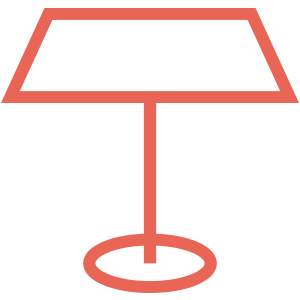
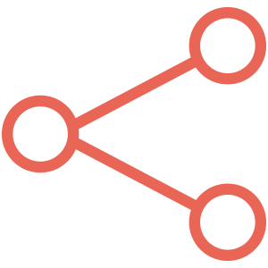

<article class="grid">
<figure>
  
  <figcaption>
    Fifth Anniversary of Civic Tech
  </figcaption>
</figure>

<hgroup>
<h1>Hacknights for everyone.</h1>

Every Tuesday from 7pm to 9pm.

</hgroup>

Civic Tech Toronto is a vibrant and diverse community of Torontonians engaged in understanding and creating solutions for civic challenges through technology, design, and other innovative means.

We now run our Hacknights in a hybrid format, welcoming both online and in-person participation every Tuesday from 7pm to 9pm. At these Hacknights, members of the community gather to hear from inspiring speakers, share and learn about civic tech stories, and collaborate on projects aimed at improving Toronto.

<a href="https://guild.host/ctto/events" target="_blank"><button class="outline">Sign Up on Guild</button></a>
<a href="/hacknights"><button class="secondary outline">Past Hacknights</button></a>

</article>

<section>
  <h2>Who's Invited</h2>
  
We invite people from all backgrounds and skill levels to join us. Whether you’re a tech expert, a curious beginner, or passionate about civic issues, your presence and contribution are valued.

  
Civic Tech Toronto is committed to fostering a safe, inclusive, and enjoyable environment for collaboration. We believe in the power of diverse perspectives and a human-centred approach in tackling civic issues, leading to remarkable outcomes.

  <a href="/code-of-conduct" class="secondary">Code of Conduct</a>
</section>

<section>
  <hgroup>
  <h2>What to Expect</h2>
  
A typical Tuesday evening Hacknight

  </hgroup>
  

    <article>
      <figure>
        
        <figcaption>
          7:00 pm - Introductions to each other and Civic Tech Toronto
        </figcaption>
      </figure>
    </article>
    <article>
          <figure>
        
        <figcaption>
          7:20 pm - Scheduled speaker presents to the group
        </figcaption>
      </figure>
    </article>
    <article>
          <figure>
        
        <figcaption>
          7:50 pm - Attendees collaborate on projects
        </figcaption>
      </figure>
  </article>

</section>

